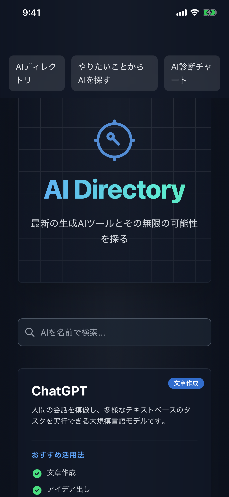
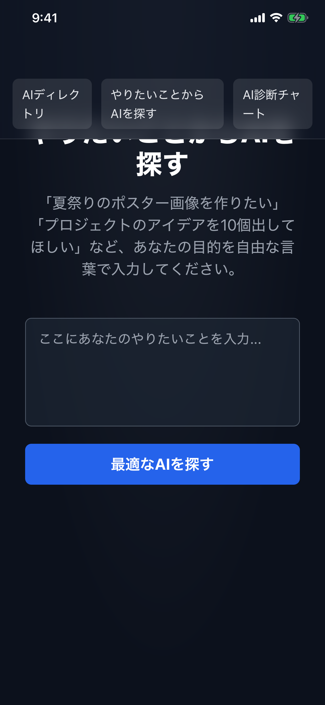
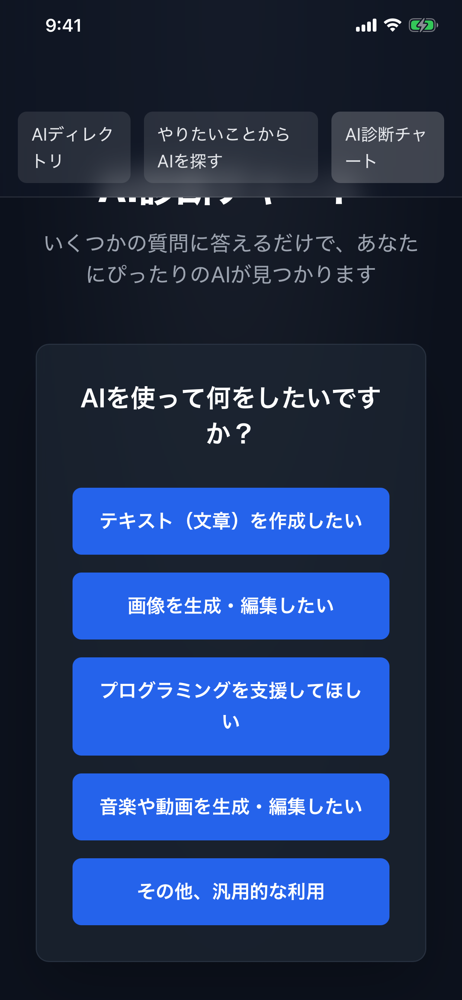
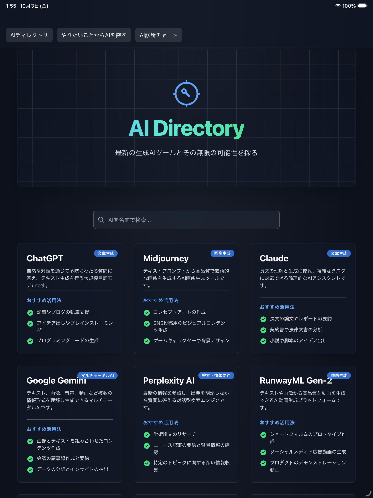

# AI-compass

## 概要

今必要としているAIの機能や、調べたAIにどんな機能があるかを検索できるアプリです。
AIツールの選択に迷ったときに、目的から最適なAIを見つけることができます。

## スクリーンショット

  
  
  
  

## 主な機能

### 🔍 AI検索機能
- キーワードでAIツールを検索
- 機能や用途から最適なAIを発見

### 🎯 やりたいことからAIを探す
- 目的ベースでAIツールを推薦
- 初心者でも使いやすいナビゲーション

### 🧪 AI診断
- 選択肢形式でユーザーに最適なAIを診断
- 質問に答えるだけで適切なツールを提案

## 開発情報

- **開発期間**: 2024年8月〜2024年9月（約1ヶ月）
- **プラットフォーム**: iOS
- **ダウンロード数**: 2

## 使用技術

### フロントエンド
- **React 19.1.1**: UIライブラリ
- **TypeScript 5.8.2**: 型安全性の確保
- **React Router DOM 7.9.2**: ルーティング管理（HashRouter使用）

### 開発ツール
- Claude / Cursor（AIアシスタント）
- Xcode

## 開発で工夫した点

### AIを活用した効率的な開発
コード生成にAIツールを活用しながらも、必ず説明コメントを付けてもらい、
仕組みを理解しながら開発を進めました。

### ユーザビリティの追求
- 複数の検索方法を用意し、ユーザーの状況に応じた使い方ができる設計
- 直感的なUI/UX設計

## 今後の展望

- AIツールのデータベース拡充
- ユーザーレビュー機能の追加
- より詳細な比較機能の実装

---

[← ポートフォリオトップに戻る](../README.md)