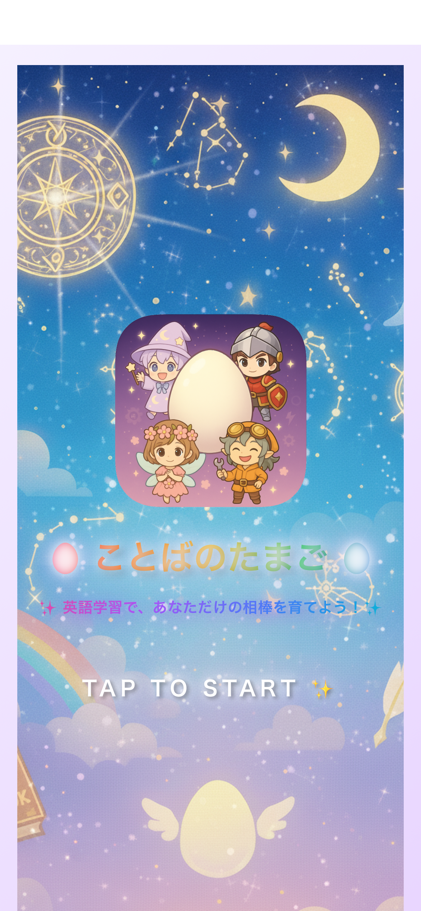
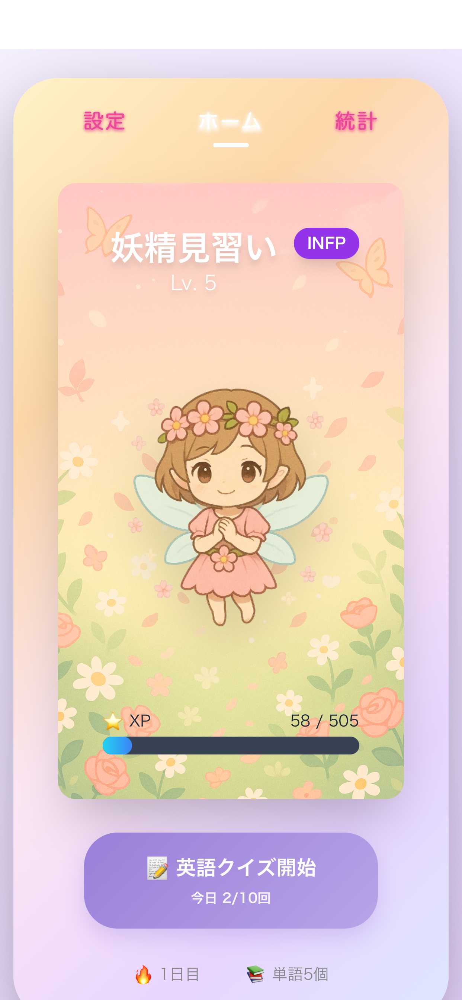
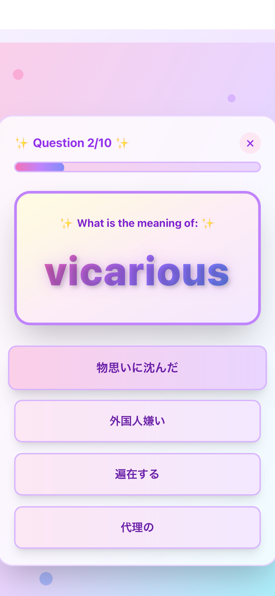
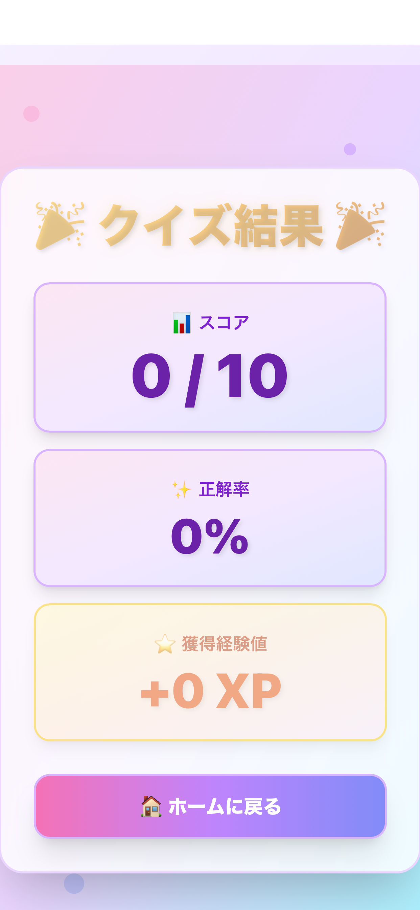
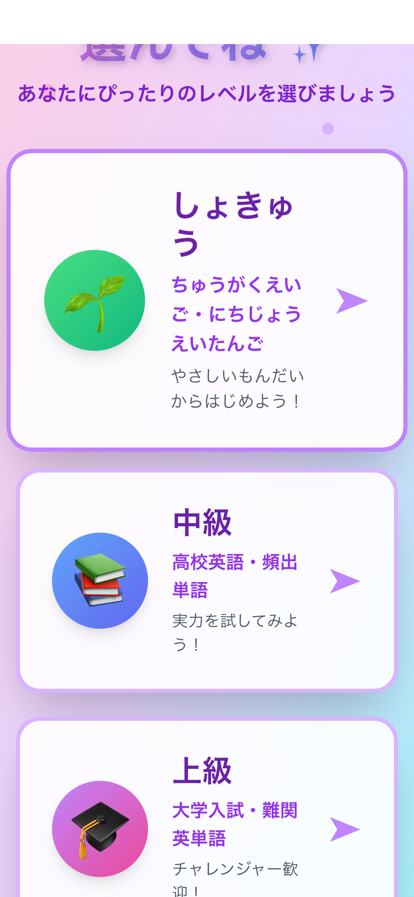
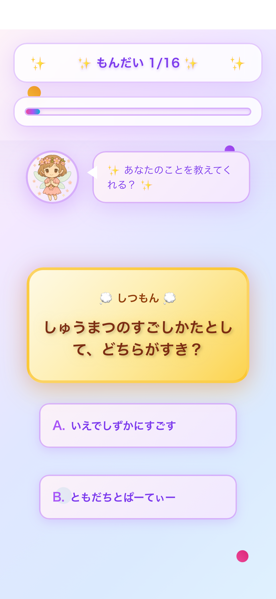
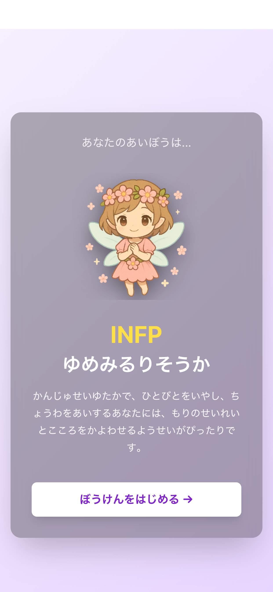

# ことばのたまご

## 概要

自分の性格（MBTI）タイプに合わせたキャラクターを育てながら英単語を学べる、
新しいタイプの英語学習アプリです。

卵からキャラクターが孵化し、学習を続けることでキャラクターが成長していく
ゲーミフィケーション要素により、楽しく継続的に英語学習ができます。

## スクリーンショット

  
  
  
  

  
  
  

## 主な機能

### 🥚 キャラクター育成システム
- MBTI診断に基づいた4種類のキャラクター（妖精、魔法使い、騎士、発明家）
- 学習進捗に応じてキャラクターが成長
- 卵から孵化する演出で学習のモチベーションアップ

### 📚 英単語学習機能
- クイズ形式で楽しく語彙を習得
- 学習統計の記録・可視化
- 進捗に応じた達成感の演出

### 🎭 MBTI診断
- アプリ内でMBTI性格診断を実施
- 診断結果に基づいたキャラクターの提案
- 自分に合った学習スタイルの発見

### 🎵 没入感のある体験
- BGM・効果音の実装
- オープニングアニメーション
- ひらがなテキスト変換機能

## 開発情報

- **開発期間**: 2024年9月〜2024年11月（約2ヶ月）
- **プラットフォーム**: iOS
- **ダウンロード数**: 5

## 使用技術

### フレームワーク・ライブラリ
- **Expo (~54.0.18)**: React Native開発フレームワーク
- **React (19.1.0)**: UIライブラリ
- **React Native (0.81.5)**: クロスプラットフォーム開発
- **TypeScript**: 型安全性の確保

### 開発ツール
- Claude / Cursor（AIアシスタント）
- Xcode

## 開発で工夫した点

### ゲーミフィケーション設計
英語学習の継続は難しいという課題に対し、キャラクター育成という
楽しい要素を組み合わせることで、自然と学習を続けられる仕組みを作りました。

### パーソナライズされた体験
MBTI診断により、ユーザーごとに異なるキャラクターが登場することで、
より愛着を持って学習に取り組める設計にしました。

### AIを活用した効率的な開発
コード生成にAIツールを活用しつつ、必ず説明を付けてもらうことで、
複雑な機能（アニメーション、音声システムなど）も理解しながら実装しました。

## 技術的チャレンジ

- React Nativeでの複雑なアニメーション実装
- 音声・BGMシステムの統合
- MBTI診断ロジックの実装
- 学習データの永続化と統計処理
- App Store提出資料の作成（スクリーンショット、説明文など）

## 今後の展望

- 学習コンテンツの拡充
- ソーシャル機能の追加（友達とキャラクター自慢など）
- 他言語への対応
- より詳細な学習分析機能

---

[← ポートフォリオトップに戻る](../README.md)