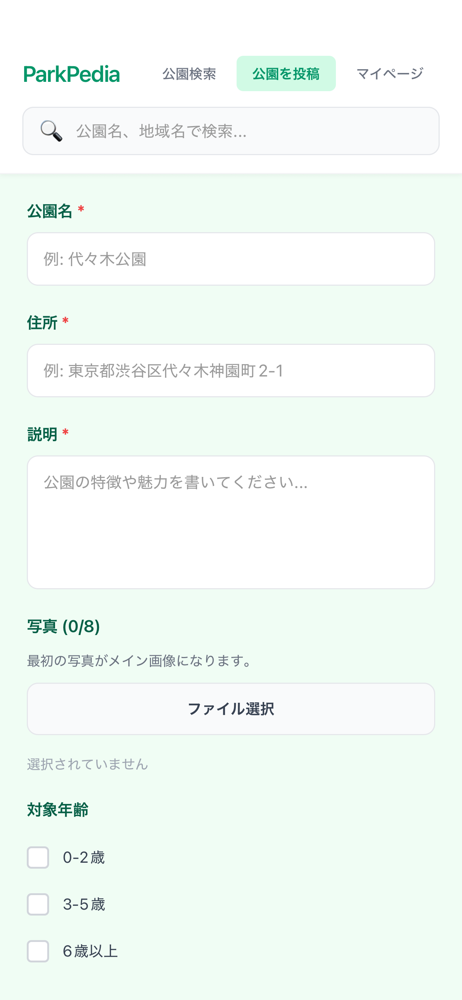
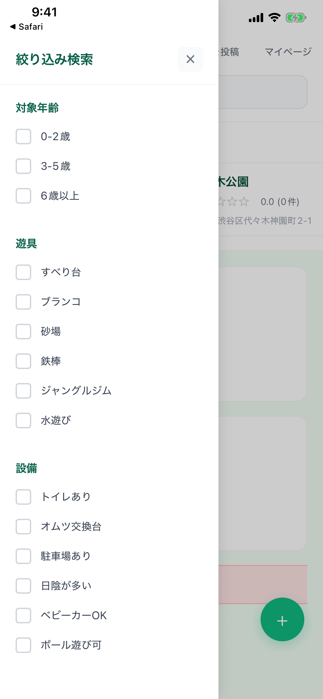
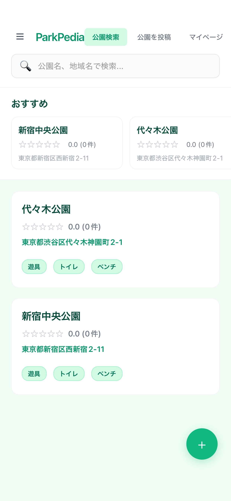
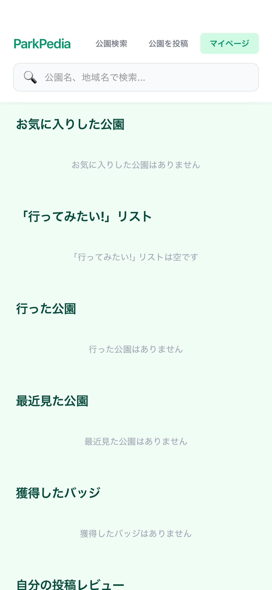

# ParkPedia

🔄 **現在の状況**: App Store審査中

## 概要

日本中の人がレビューや写真を投稿し、みんなでおすすめの公園情報を集めて完成させる
コミュニティ型の公園発見アプリです。

地域の隠れた名所や、家族連れに優しい公園など、実際に訪れた人の生の声を
集めることで、より価値のある公園情報データベースを作り上げていきます。

## スクリーンショット

  
  
  
  

## 主な機能（予定）

### 🗺️ 公園検索・発見
- 位置情報から近くの公園を検索
- 地図上での公園表示
- エリア・特徴での絞り込み検索

### 📝 レビュー・投稿機能
- 実際に訪れた公園のレビュー投稿
- 写真のアップロード
- 評価システム（星評価など）

### 👥 コミュニティ機能
- ユーザー間での情報共有
- お気に入り公園の登録
- おすすめ公園の発見

## 開発情報

- **開発状況**: App Store審査中（2024年11月時点）
- **プラットフォーム**: iOS

## 使用技術

### フレームワーク・ライブラリ
- **React Native**: クロスプラットフォーム開発
- **Firebase**: バックエンド・データベース
  - Authentication（認証）
  - Firestore（データベース）
  - Storage（画像保存）

### 開発ツール
- Claude / Cursor（AIアシスタント）
- Xcode

## 開発で工夫している点

### ユーザー生成コンテンツ（UGC）の設計
ユーザーが自発的に情報を投稿したくなるような仕組み作りを意識しています。

### リアルタイムデータ同期
Firebaseを活用し、投稿された情報が即座に反映される設計を目指しています。

### 子育て世代向けの視点
自身が子育て世代として、どんな情報があると便利かという視点で機能を設計しています。

## 技術的チャレンジ

- 地図APIの統合
- 画像アップロード・最適化処理
- Firebaseのセキュリティルール設定
- ユーザー認証フローの実装
- iPad対応での課題解決（審査対応中）

## 今後の展望

- App Store審査通過・リリース
- ユーザーフィードバックに基づいた機能改善
- コミュニティ機能の拡充
- より詳細な公園情報（設備、アクセス情報など）の追加

---

[← ポートフォリオトップに戻る](../README.md)